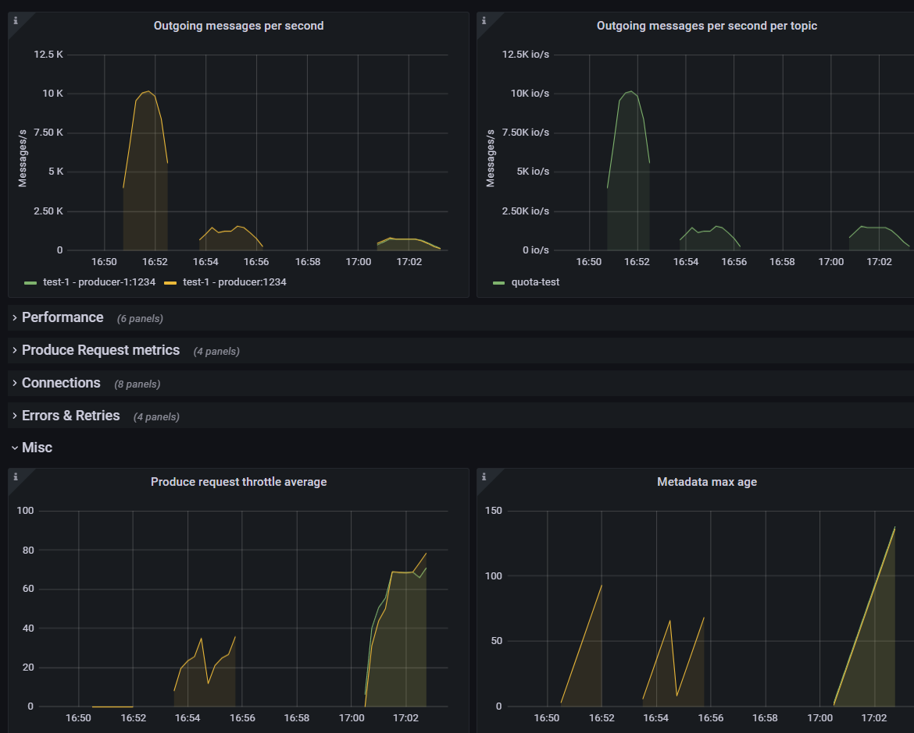

# Kafka Quota example
Simple example of applying quotas to user, client-id in a SASL_PLAIN cluster.

Client and broker side JMX metrics (included the ones related to quotas and throttling) are exported to Prometheus

Log to Graphana http://localhost:3000 to see Consumer, Producer, Broker relevant metrics insights while executing the steps

## Requirements
All the commands are executed inside the containers so the only requirements to run this project are

* Docker Engine
* docker-compose CLI
## Steps
Start the cluster

```shell

docker-compose  up  -d

```

Create and review a topic

```shell
docker-compose  exec  --env  KAFKA_OPTS=''  -it  kafka-1  kafka-topics  --topic  quota-test  --create  --bootstrap-server  kafka-1:9094  --partitions  4  --replication-factor  3
# verify topic properties

docker-compose  exec  --env  KAFKA_OPTS=''  -it  kafka-1  kafka-topics  --topic  quota-test  --describe  --bootstrap-server  kafka-1:9094

```
Log into a producer and try to produce at highest possible rate without quotas and check the throttle metrics
```shell
# log into the the producer container

docker-compose  exec  -it  producer  sh
# execute this command from the producer container
kafka-producer-perf-test  --throughput  -1  --num-records  100000  --topic  quota-test  --record-size  1024  --producer-props  bootstrap.servers=kafka-1:9092  acks=all  client.id=test-1  --producer.config  /etc/client-configs/producer1.properties  --print-metrics 2>&1 | tee  /tmp/metrics
# inspect throttle metrics, value should be 0
grep  throttle  /tmp/metrics
```
Add quotas
```shell

# execute this command from your host

docker-compose  exec  --env  KAFKA_OPTS=''  -it  kafka-1  kafka-configs  --bootstrap-server  kafka-1:9094  --alter  --add-config  'producer_byte_rate=512000'  --entity-type  users  --entity-name  producer1
```

Launch the producer again (check the metrics)

```shell

# log into the the producer container

docker-compose  exec  -it  producer  sh

# execute this commands from the producer container (should be slower now)

# check the throughput, even if the quota is set to 0.5MB/s, you should see something near 1.5MB/s. Why? quotas are per-broker. In this example we are producing to a topic where partition leaders are spread among all the 3 brokers

kafka-producer-perf-test  --throughput  -1  --num-records  100000  --topic  quota-test  --record-size  1024  --producer-props  bootstrap.servers=kafka-1:9092  acks=all  client.id=test-1  --producer.config  /etc/client-configs/producer1.properties  --print-metrics 2>&1 | tee  /tmp/metrics
# inspect throttle metrics, value should be > 0
grep  throttle  /tmp/metrics

```

Launch multiple producer instances again (check the metrics)
```shell

# log into the the producer and producer-1 containers

docker-compose  exec  -it  producer  sh
docker-compose  exec  -it  producer-1  sh

# run in each container the command. check the throughgput in both clients, as we are using the same user,client.id in both instances, the quota is split among te clients

kafka-producer-perf-test  --throughput  -1  --num-records  100000  --topic  quota-test  --record-size  1024  --producer-props  bootstrap.servers=kafka-1:9092  acks=all  client.id=test-1  --producer.config  /etc/client-configs/producer1.properties  --print-metrics 2>&1 | tee  /tmp/metrics
```
Optional: remove quotas and check back to first status

```shell

#execute this command from your host

docker-compose  exec  --env  KAFKA_OPTS=''  -it  kafka-1  kafka-configs  --bootstrap-server  kafka-1:9094  --alter  --delete-config  'producer_byte_rate'  --entity-type  users  --entity-name  producer1

```
check the throttling metrics after quotas config deletion

```shell

#execute this command from your host

kafka-producer-perf-test  --throughput  -1  --num-records  100000  --topic  quota-test  --record-size  1024  --producer-props  bootstrap.servers=kafka-1:9092  acks=all  client.id=test-1  --producer.config  /etc/client-configs/producer1.properties  --print-metrics 2>&1 | tee  /tmp/metrics

# inspect throttle metrics, values should be 0

grep  throttle  /tmp/metrics

```
## Grafana Dashbaords

Log into [Grafana Dashboard](http://localhost:3000) and open it two distinct tabs *Kafka Overview* and *Producers* dashboards

### Producers dashboards considerations

When executing the commands descibed in this guide you should see 3 waves of data in the graphs. As an example let's analyze the following screenshot:

 -  ~ 10k *Outgoing messages per second* when there are no quotas configured
 - ~ 1.5k *Outgoing messages per second* when producing from a single producer
 - ~ 750 *Outgoing messages per second* for each client (producer and producer-1). As you can see the total amount of  *Outgoing messages per second per topic* is the same also with 2 producers as the quota is shared among the clients

Observe the chart "Produce request throttle average"

 - no throttling at all during the first wave
 - >0 throttling time in the second and third wave





